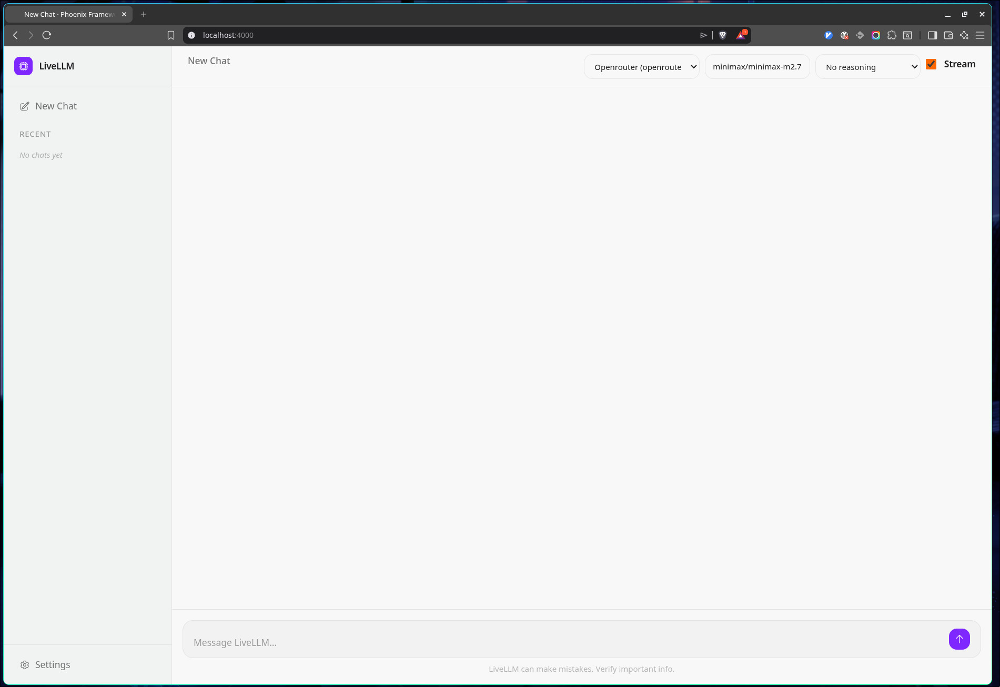
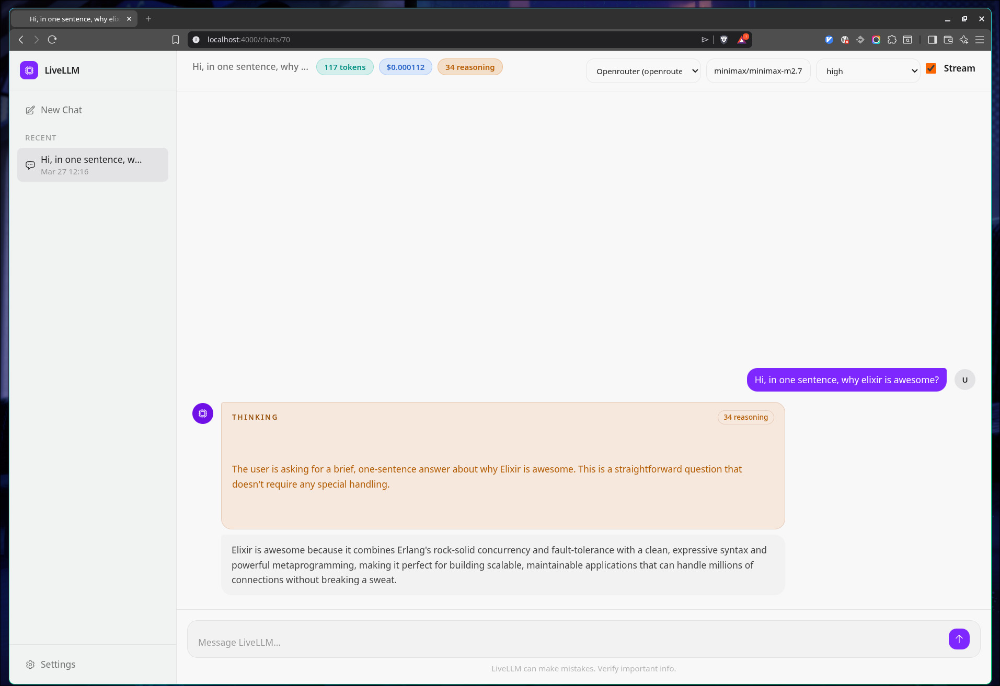

# Livellm

Livellm is a minimal Phoenix LiveView chat app built as a working reference for integrating [`llm_composer`](https://github.com/doofinder/llm_composer) — an Elixir library that normalizes LLM provider calls. It shows how to wire multi-provider streaming, reasoning output, token cost tracking, and stateful conversation into a real product, using standard Elixir/OTP and Phoenix LiveView patterns throughout.

Upstream library: https://github.com/doofinder/llm_composer

This `master` branch keeps the app focused on the simple chat demo. If you want the more advanced tool-usage showcase, use the `showcase/tool-usage` branch.

## Screenshots

| New chat | Streaming with reasoning |
| --- | --- |
|  |  |

## What You Can Learn From This App

### From `llm_composer`

- **Multi-provider dispatch behind one API** — switch between OpenAI, OpenRouter, Ollama, and Google without changing the calling code
- **Streaming** — incrementally render provider responses as they arrive using `LlmComposer.parse_stream_response/2`
- **Reasoning output** — capture and display reasoning tokens separately when the model supports it
- **Reasoning-effort passthrough** — forward effort hints to providers that accept them (OpenAI Responses, OpenRouter)
- **Token and cost tracking** — normalized usage data across providers via `LlmComposer.CostInfo`
- **Responses API continuity** — reuse `previous_response_id` for conversation continuity on OpenAI's Responses API
- **Provider-specific request shaping** — prompt cache keys, request params, and per-provider options without breaking the abstraction

### From the Elixir/Phoenix stack

- **`Task.Supervisor`** — LLM calls run in supervised background tasks so LiveView is never blocked
- **`GenServer` + ETS (`ActiveTasks`)** — tracks in-flight tasks so a reconnected LiveView can restore its loading state after a page reload
- **`Phoenix.PubSub`** — background tasks broadcast stream chunks and completion events to the LiveView in real time
- **LiveView streams** — `stream/3` keeps the message list memory-efficient and diff-friendly
- **`handle_info` pattern** — LiveView receives `:stream_chunk`, `:stream_reasoning`, `:stream_done`, and `:llm_done` messages and updates assigns accordingly
- **Supervision tree** — the app's `Application` module shows the full startup order: Repo, Finch, ETS cache, PubSub, task supervisor, endpoint

## How It Works

1. User sends a message in LiveView (`chat_live.ex` → `handle_event("send_message", ...)`)
2. The user message is persisted to SQLite; a `Task.Supervisor` child is spawned and the chat is marked active in `ActiveTasks`
3. The background task calls `LlmRunner.run/1`, which builds a `LlmComposer.Settings` struct and calls `LlmComposer.run_completion/2`
4. For streaming responses: the task iterates `LlmComposer.parse_stream_response/2` and broadcasts each `:stream_chunk` and `:stream_reasoning` via `Phoenix.PubSub`
5. The LiveView receives broadcasts via `handle_info`, updates the message assign, and re-renders incrementally
6. On completion, the normalized response (text, reasoning, tokens, cost, response IDs) is persisted as an assistant message, the task is cleared from `ActiveTasks`, and `:stream_done` or `:llm_done` is broadcast

## Key Files

| File | What to learn |
| --- | --- |
| `lib/livellm/chats/llm_runner.ex` | Provider dispatch, request shaping, reasoning and cache hint forwarding |
| `lib/livellm_web/live/chat_live.ex` | Full async dispatch, streaming, PubSub wiring, `handle_info` pattern |
| `lib/livellm/chats/active_tasks.ex` | Minimal GenServer+ETS pattern for tracking in-flight tasks |
| `lib/livellm/application.ex` | Supervision tree and startup ordering |
| `lib/livellm/usage.ex` | Token/cost normalization from `llm_composer` responses |

## Supported Providers

| Provider | Credentials | Base URL override | Reasoning effort | Streaming |
| --- | --- | --- | --- | --- |
| `openai` | API key | Yes | UI only, not forwarded | Yes |
| `openai_responses` | API key | Yes | Forwarded | Yes |
| `openrouter` | API key | Yes | Forwarded | Yes |
| `ollama` | Optional | Yes | UI only, not forwarded | Yes |
| `google` | API key | Yes | UI only, not forwarded | Yes |

Notes:

- Model names are entered manually
- Capability support depends on the selected model and provider behavior
- The reasoning selector is visible for all providers; only `openai_responses` and `openrouter` currently forward the effort value

## Local Setup

Prerequisites: Elixir and Erlang compatible with this project, a working Phoenix development environment.

```bash
mix setup
mix phx.server
```

Then open http://localhost:4000

`mix setup` installs dependencies, creates the local SQLite database, runs migrations, seeds the database, and builds assets.

## Getting Started

All data — provider credentials and chat history — is stored in a local SQLite database (`livellm_dev.db` in the project root). Nothing is sent to any external service other than the LLM provider calls you configure.

**Step 1 — configure a provider**

Before you can chat you need at least one active provider. Open **Settings**, add a provider with:

- Provider type (e.g. `openai_responses`, `openrouter`, `ollama`)
- A label for your own reference
- API key, if required by the provider
- Optional default model and base URL override

Mark the provider as active.

**Step 2 — start chatting**

Click **New Chat**, pick your provider and model from the chat header, and send a message.

---

## How To Use Livellm

1. Open `Settings`.
2. Add a provider configuration with provider type, label, API key if required, optional default model, and optional base URL override.
3. Mark one provider config as active.
4. Start a new chat.
5. Choose the provider, model, reasoning effort, and streaming mode from the chat header.
6. Send messages and inspect the response stream, reasoning panel, and token/cost badges in the header.

Behavior details:

- Chats are persisted in the local database.
- Assistant messages store normalized metadata: provider name, model, token counts, cached tokens, reasoning tokens, cost, and provider response IDs when available.
- Per-chat UI settings for provider/model/reasoning/streaming are restored from browser `localStorage`.

## Current Limitations

Livellm is intentionally minimal and is not a full Open WebUI replacement.

- No authentication or multi-user isolation.
- Provider credentials and chat history are stored locally in the app database.
- Model capability detection is manual — unsupported provider/model/option combinations can fail at runtime.

## Development

```bash
mix test
mix precommit
```

Use `mix precommit` before finalizing changes. It compiles with warnings as errors, formats code, runs Credo, and runs the test suite.

## Reference

For full `llm_composer` documentation, provider coverage, and advanced usage patterns:

- https://github.com/doofinder/llm_composer
